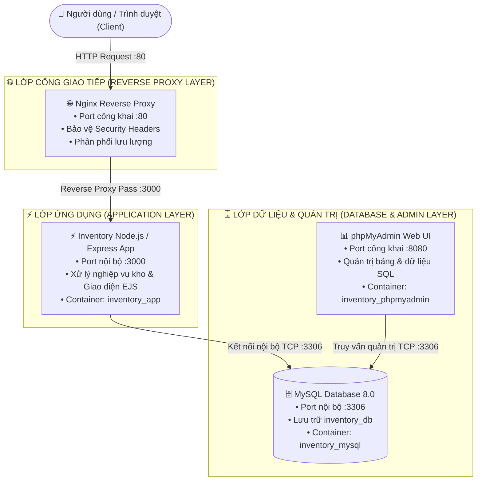
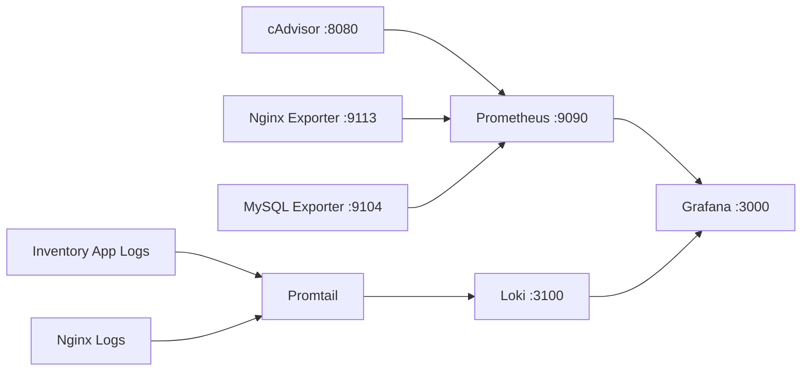
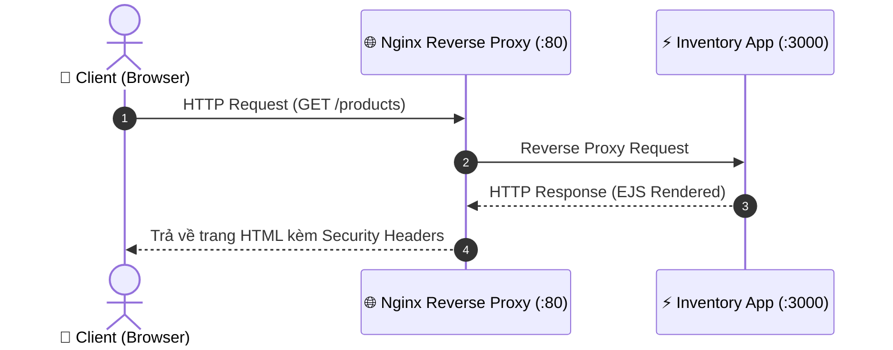
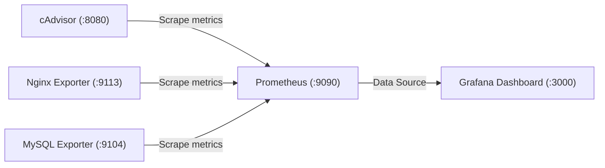
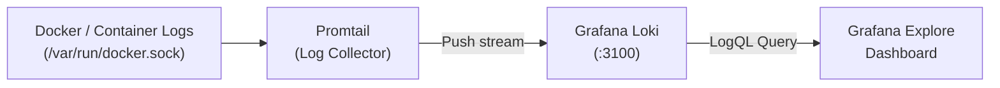
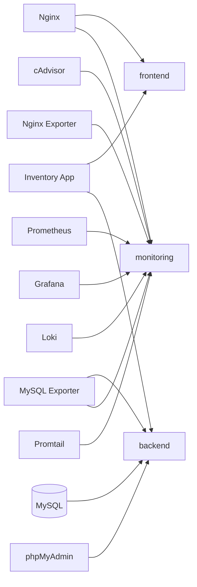

# HỆ THỐNG QUẢN LÝ KHO HÀNG (INVENTORY MANAGEMENT SYSTEM)
**Môn học:** Triển khai và Quản trị Hệ thống Phần mềm

**Sinh viên:** NGÔ QUANG MINH

**Mã sinh viên:** DTC245160017

**Lớp:** KHMT K23A

---

## 1. Giới thiệu
Đây là đề tài thực hành **Hệ thống Quản lý Kho Hàng (Inventory Management System)** được triển khai theo mô hình container hóa hoàn chỉnh bằng Docker Compose.

Hệ thống hỗ trợ các chức năng chính:

- Quản lý sản phẩm.
- Quản lý nhà cung cấp.
- Nhập kho.
- Xuất kho.
- Theo dõi số lượng tồn kho.
- Theo dõi lịch sử nhập/xuất hàng.
- Quản trị cơ sở dữ liệu bằng phpMyAdmin.
- Reverse Proxy bằng Nginx.
- Giám sát hệ thống bằng Prometheus + Grafana.
- Thu thập và truy vấn log tập trung bằng Loki + Promtail + LogQL.
- Áp dụng các biện pháp hardening cơ bản cho hệ thống.

Toàn bộ ứng dụng và các dịch vụ liên quan được triển khai bằng Docker Compose.

---

## 2. Kiến trúc hệ thống
### 2.1. Sơ đồ kiến trúc ứng dụng


---

### 2.2. Sơ đồ Monitoring & Centralized Logging


---

### 2.3. Cấu trúc cây tổng quan các phân hệ
```text
HỆ THỐNG QUẢN LÝ KHO HÀNG (INVENTORY MANAGEMENT SYSTEM)
├── 🌐 PHÂN HỆ WEB & NGHIỆP VỤ (CORE APP)
│   ├── Nginx (:80) ───────────────> Tiếp nhận HTTP request & bảo vệ Security Headers
│   ├── Node.js / Express (:3000) ──> Xử lý logic nghiệp vụ, render giao diện EJS
│   └── MySQL Database (:3306) ────> Lưu trữ sản phẩm, nhà cung cấp, giao dịch kho
├── 🗄️ PHÂN HỆ QUẢN TRỊ DATABASE
│   └── phpMyAdmin (:8080) ────────> Giao diện đồ họa quản trị MySQL
├── 📊 PHÂN HỆ GIÁM SÁT (MONITORING)
│   ├── cAdvisor (:8080) ──────────> Thu thập chỉ số tài nguyên container (CPU/RAM/IO)
│   ├── Nginx Exporter (:9113) ────> Thu thập trạng thái kết nối Nginx
│   ├── MySQL Exporter (:9104) ────> Thu thập trạng thái và truy vấn MySQL
│   └── Prometheus (:9090) ────────> Máy chủ TSDB lưu trữ chỉ số giám sát
└── 📜 PHÂN HỆ LOG TẬP TRUNG (LOGGING)
    ├── Promtail ──────────────────> Thu thập log trực tiếp từ Docker Daemon Socket
    ├── Grafana Loki (:3100) ──────> Máy chủ lưu trữ và đánh chỉ mục log stream
    └── Grafana (:3000) ───────────> Dashboard trực quan hóa Metrics & truy vấn LogQL
```

---

### 2.4. Các luồng hoạt động chi tiết của hệ thống
#### 📌 Luồng 1: Xử lý yêu cầu nghiệp vụ người dùng (Application Traffic Flow)
```text
Người dùng / Trình duyệt
└── 🌐 1. Gửi HTTP Request (Port 80) đến Nginx Reverse Proxy
    └── 🛡️ 2. Nginx kiểm tra, áp dụng Security Headers & định tuyến request
        └── ⚡ 3. Chuyển tiếp request đến Node.js App (Port nội bộ 3000)
            └── 🗄️ 4. Node.js kết nối MySQL (Port nội bộ 3306) thực thi truy vấn ACID
                └── 📄 5. Node.js render view EJS kèm dữ liệu trả về cho Nginx
                    └── 🖥️ 6. Nginx phản hồi HTML hoàn chỉnh tới trình duyệt người dùng
```

#### 📌 Luồng 2: Thu thập và hiển thị giám sát (Monitoring Flow)
```text
Các Container dịch vụ (Nginx, MySQL, App)
└── 📡 1. cAdvisor, Nginx Exporter, MySQL Exporter trích xuất chỉ số hoạt động
    └── 🎯 2. Prometheus định kỳ cào (Scrape) metrics qua các cổng Exporter (9113, 9104, 8080)
        └── 💾 3. Prometheus lưu dữ liệu vào Time-Series Database
            └── 📊 4. Grafana truy vấn Prometheus và vẽ biểu đồ dashboard thời gian thực (:3000)
```

#### 📌 Luồng 3: Thu thập và truy vấn log tập trung (Centralized Logging Flow)
```text
Các Container ứng dụng ghi Log ra stdout / stderr
└── 🐳 1. Docker Daemon cung cấp API qua /var/run/docker.sock
    └── 📥 2. Promtail dùng Docker socket để phát hiện/đọc log container và gắn nhãn (container, service, compose_project)
        └── 🗃️ 3. Promtail đẩy các stream log về máy chủ Grafana Loki (:3100)
            └── 🔍 4. Quản trị viên dùng Grafana Explore truy vấn log bằng cú pháp LogQL
```

#### 📌 Luồng 4: Quản trị cơ sở dữ liệu (Database Administration Flow)
```text
Quản trị viên (Admin)
└── 💻 1. Truy cập giao diện phpMyAdmin qua trình duyệt (Port 8080)
    └── 🔒 2. phpMyAdmin kết nối trực tiếp MySQL trong mạng backend nội bộ (Port 3306)
        └── 🗄️ 3. Xem cấu trúc bảng, kiểm tra khóa ngoại và sao lưu dữ liệu kho
```

---

## 3. Công nghệ sử dụng
| Thành phần | Công nghệ |
| :--- | :--- |
| **Web Application** | Node.js + Express |
| **Template / UI** | EJS + HTML5 + CSS3 + Vanilla JavaScript |
| **Database** | MySQL 8.0 |
| **Database Management** | phpMyAdmin |
| **Reverse Proxy** | Nginx 1.27 Alpine |
| **Containerization** | Docker |
| **Orchestration** | Docker Compose |
| **Monitoring** | Prometheus v3.14.0 |
| **Dashboard** | Grafana 13.2.1 |
| **Container Metrics** | cAdvisor v0.60.6 |
| **Web Metrics** | Nginx Exporter 1.5.3 |
| **Database Metrics** | MySQL Exporter v0.20.0 |
| **Centralized Logging** | Loki 3.7.0 |
| **Log Collector** | Promtail 3.6.11 |
| **Log Query** | LogQL |
| **Version Control** | Git + GitHub |
| **Deployment Environment** | Ubuntu Linux trên VMware Workstation Pro |

---

## 4. Chức năng hệ thống
### 4.1. Quản lý sản phẩm
- Xem danh sách sản phẩm với phân trang, lọc theo nhà cung cấp, lọc theo trạng thái tồn kho, tìm kiếm theo tên/SKU và sắp xếp đa tiêu chí.
- Thêm sản phẩm mới với tên, SKU duy nhất, giá bán và nhà cung cấp.
- Chỉnh sửa thông tin sản phẩm (tên, SKU, giá, nhà cung cấp).
- Xem chi tiết thông số sản phẩm và lịch sử giao dịch liên quan.
- Xóa sản phẩm với xác nhận an toàn.
- Quản lý mã SKU duy nhất, cảnh báo trùng lặp.
- Quản lý giá tiền và tự động định dạng hiển thị VNĐ.
- Theo dõi số lượng tồn kho và trạng thái trực quan bằng pill badge (`Còn hàng`, `Sắp hết`, `Hết hàng`).

### 4.2. Quản lý nhà cung cấp
- Xem danh sách nhà cung cấp với phân trang, tìm kiếm và sắp xếp.
- Thêm nhà cung cấp mới với tên, số điện thoại, email, địa chỉ.
- Xem chi tiết thông tin nhà cung cấp và danh mục sản phẩm trực thuộc.
- Chỉnh sửa thông tin nhà cung cấp.
- Xóa nhà cung cấp.

### 4.3. Nhập kho
- Chọn sản phẩm từ danh mục có hiển thị số lượng tồn kho hiện tại.
- Nhập số lượng cần bổ sung (yêu cầu lớn hơn 0).
- Nhập ghi chú giao dịch.
- Tự động tăng số lượng tồn kho trong database bằng MySQL transaction đảm bảo tính toàn vẹn (ACID).
- Tự động ghi nhận giao dịch `IMPORT` vào bảng `inventory_transactions`.

### 4.4. Xuất kho
- Chọn sản phẩm cần xuất kho.
- Nhập số lượng xuất (yêu cầu lớn hơn 0).
- Nhập ghi chú giao dịch.
- Cơ chế khóa hàng `FOR UPDATE` trong MySQL transaction: tự động kiểm tra số lượng tồn hiện có, từ chối giao dịch nếu xuất vượt quá tồn kho (tránh âm kho).
- Tự động giảm số lượng tồn kho khi hợp lệ.
- Tự động ghi nhận giao dịch `EXPORT` vào bảng `inventory_transactions`.

### 4.5. Lịch sử giao dịch
Hệ thống lưu lại chi tiết:

- Sản phẩm liên quan (Tên, SKU).
- Loại giao dịch (`IMPORT` / `EXPORT`).
- Số lượng thay đổi.
- Ghi chú giao dịch.
- Thời gian thực hiện (timestamp).

---

## 5. Cấu trúc thư mục
```text
DTC245160017-He-thong-QL-Kho/
+-- app/
|   +-- src/
|   |   +-- config/
|   |   |   +-- database.js
|   |   +-- routes/
|   |   |   +-- inventoryRoutes.js
|   |   |   +-- productRoutes.js
|   |   |   +-- supplierRoutes.js
|   |   +-- views/
|   |   |   +-- inventory/
|   |   |   |   +-- index.ejs
|   |   |   +-- products/
|   |   |   |   +-- detail.ejs
|   |   |   |   +-- edit.ejs
|   |   |   |   +-- index.ejs
|   |   |   +-- suppliers/
|   |   |   |   +-- detail.ejs
|   |   |   |   +-- edit.ejs
|   |   |   |   +-- index.ejs
|   |   |   +-- dashboard.ejs
|   |   +-- public/
|   |   |   +-- css/
|   |   |   |   +-- style.css
|   |   |   +-- js/
|   |   |       +-- filters.js
|   |   +-- server.js
|   +-- package.json
|   +-- Dockerfile
+-- mysql/
|   +-- init.sql
+-- nginx/
|   +-- nginx.conf
+-- prometheus/
|   +-- prometheus.yml
+-- grafana/
|   +-- provisioning/
|       +-- datasources/
|           +-- prometheus.yml
|           +-- loki.yml
+-- loki/
|   +-- loki-config.yml
+-- promtail/
|   +-- promtail-config.yml
+-- docker-compose.yml
+-- .env.example
+-- .gitignore
+-- README.md
```

---

## 6. Yêu cầu môi trường
Máy triển khai cần cài đặt sẵn:

```bash
docker --version
docker compose version
git --version
```

Môi trường sử dụng trong bài:

- VMware Workstation Pro.
- Ubuntu Linux VM.
- Docker Engine.
- Docker Compose.
- Git.

---

## 7. Clone repository
```bash
git clone https://github.com/nqm16082006-ux/DTC245160017-He-thong-QL-Kho.git
```

Đi vào thư mục dự án:

```bash
cd DTC245160017-He-thong-QL-Kho
```

---

## 8. Cấu hình biến môi trường
Sao chép file mẫu:

```bash
cp .env.example .env
```

Sau đó chỉnh sửa nội dung file cấu hình:

```bash
nano .env
```

Ví dụ nội dung file cấu hình:

```env
MYSQL_ROOT_PASSWORD=CHANGE_TO_STRONG_PASSWORD
MYSQL_DATABASE=inventory_db
MYSQL_USER=inventory_user
MYSQL_PASSWORD=CHANGE_TO_STRONG_PASSWORD
MYSQL_EXPORTER_PASSWORD=CHANGE_TO_STRONG_PASSWORD
DB_HOST=mysql
DB_PORT=3306
DB_NAME=inventory_db
DB_USER=inventory_user
DB_PASSWORD=CHANGE_TO_STRONG_PASSWORD
GRAFANA_ADMIN_USER=admin
GRAFANA_ADMIN_PASSWORD=CHANGE_TO_STRONG_PASSWORD
```

> **Lưu ý bảo mật:** Tuyệt đối không commit file `.env` lên GitHub. Repository chỉ lưu `.env.example`.

---

## 9. Khởi chạy hệ thống
Kiểm tra cú pháp cấu hình Docker Compose:

```bash
docker compose config
```

Build và khởi động tất cả container ở chế độ nền (detached):

```bash
docker compose up -d --build
```

Kiểm tra trạng thái các dịch vụ:

```bash
docker compose ps
```

Tất cả container chính phải ở trạng thái `Up` hoặc `healthy`.

---

## 10. Truy cập các dịch vụ
Thay `SERVER_IP` bằng địa chỉ IP của Ubuntu VM.

Lấy địa chỉ IP máy chủ:

```bash
hostname -I
```

| Dịch vụ | Địa chỉ | Ghi chú |
| :--- | :--- | :--- |
| **Inventory Website** | `http://SERVER_IP` | Truy cập ứng dụng qua Nginx (:80) |
| **phpMyAdmin** | `http://SERVER_IP:8080` | Quản trị cơ sở dữ liệu MySQL |
| **Grafana** | `http://SERVER_IP:3000` | Trực quan hóa metrics & log explore |
| **Prometheus** | `http://SERVER_IP:9090` | Thu thập metrics và quản lý target |

Sau khi Nginx được cấu hình, người dùng truy cập Inventory Website qua Nginx và không truy cập trực tiếp port nội bộ của ứng dụng.

---

## 11. Kiểm tra ứng dụng và Database
### 11.1. Health Check
```bash
curl http://localhost/health
```

Kết quả mong đợi:

```json
{
  "status": "healthy",
  "database": "connected"
}
```

### 11.2. Kiểm tra MySQL
```bash
docker exec -it inventory_mysql mysql -u inventory_user -p
```

Sau khi nhập mật khẩu:

```sql
USE inventory_db;
SHOW TABLES;
```

Các bảng chính:

- `suppliers`
- `products`
- `inventory_transactions`

---

## 12. Nginx Reverse Proxy
### Luồng xử lý request qua Nginx


Kiểm tra cú pháp cấu hình Nginx:

```bash
docker exec inventory_nginx nginx -t
```

Kết quả mong đợi:

```text
syntax is ok
test is successful
```

Kiểm tra Reverse Proxy:

```bash
curl http://localhost
```

Kiểm tra health endpoint qua Nginx:

```bash
curl http://localhost/health
```

---

## 13. Security Headers Nginx
Hệ thống cấu hình các HTTP security headers cơ bản:

- `X-Frame-Options`
- `X-Content-Type-Options`
- `Referrer-Policy`
- `Permissions-Policy`
- `Content-Security-Policy`

Kiểm tra headers bằng lệnh:

```bash
curl -I http://localhost
```

Ví dụ kết quả:

```http
HTTP/1.1 200 OK
Server: nginx
X-Frame-Options: SAMEORIGIN
X-Content-Type-Options: nosniff
Referrer-Policy: strict-origin-when-cross-origin
Permissions-Policy: camera=(), microphone=(), geolocation=()
Content-Security-Policy: default-src 'self'; ...
```

---

## 14. Prometheus Monitoring
Prometheus được sử dụng để định kỳ cào (scrape) metrics từ các thành phần trong hệ thống:

- Docker / Container Metrics: `cAdvisor`
- Web Server Metrics: `Nginx Exporter`
- Database Metrics: `MySQL Exporter`



Kiểm tra trạng thái Prometheus:

```text
http://SERVER_IP:9090
```

Truy cập: **Status** -> **Targets**. Tất cả các targets cần ở trạng thái **UP**.

---

## 15. Grafana Dashboard
Grafana được sử dụng để trực quan hóa dữ liệu thu thập từ Prometheus.

Dashboard thể hiện các nhóm thông tin quan trọng:

- CPU container.
- RAM container.
- Network I/O container.
- Trạng thái container (Up / Down).
- Metrics Nginx (Active connections, Request rate).
- Metrics MySQL (Queries per second, Connections, Buffer pool).

Truy cập:

```text
http://SERVER_IP:3000
```

---

## 16. Loki + Promtail Centralized Logging
### Luồng thu thập và truy vấn log tập trung


- **Promtail:** Phát hiện container qua Docker socket, thu thập log của `inventory_app` và `inventory_nginx`, gắn labels rồi gửi log đến Loki.
- **Loki:** Lưu trữ tối ưu và phục vụ truy vấn log stream.
- **Grafana Explore:** Cung cấp giao diện truy vấn và phân tích log thời gian thực.

---

## 17. LogQL
Trong Grafana, truy cập: **Explore** -> Chọn Data Source **Loki**.

Một số truy vấn LogQL sử dụng để demo:

**Query 1 - Xem Log Nginx:**

```logql
{container="inventory_nginx"}
```

**Query 2 - Xem Log ứng dụng Node.js:**

```logql
{container="inventory_app"}
```

**Query 3 - Lọc các yêu cầu HTTP GET:**

```logql
{container="inventory_nginx"} |= "GET"
```

---

## 18. Hardening hệ thống
Hệ thống áp dụng các biện pháp bảo mật sau:

### 18.1. Không lưu mật khẩu trong GitHub
- File `.env` được khai báo trong `.gitignore`.
- Repository chỉ lưu `.env.example`.

### 18.2. Sử dụng mật khẩu mạnh
- MySQL và Grafana sử dụng mật khẩu mạnh được nạp thông qua biến môi trường.

### 18.3. Hạn chế quyền Database
- Ứng dụng Node.js sử dụng tài khoản `inventory_user`, không dùng `root`.
- User ứng dụng chỉ được cấp các quyền cần thiết trên `inventory_db`: `SELECT`, `INSERT`, `UPDATE`, `DELETE`.

### 18.4. Network Isolation (Phân vùng mạng)

Docker network được tách biệt thành 3 mạng bridge:

- `frontend`
- `backend`
- `monitoring`



Nguyên tắc phân quyền mạng:

- `Nginx` -> thuộc `frontend` và `monitoring`
- `App` -> thuộc `frontend` và `backend`
- `MySQL` -> thuộc `backend` (Nginx không thể kết nối trực tiếp MySQL)
- `Monitoring` -> cô lập riêng các exporter, prometheus, loki và grafana

### 18.5. Không public trực tiếp port ứng dụng
- Container Node.js chỉ mở port nội bộ 3000 trong mạng Docker (`expose: - "3000"`).
- Người dùng chỉ có thể truy cập thông qua Reverse Proxy `Nginx:80`.

### 18.6. Security Headers
- Nginx cấu hình các HTTP Security Headers chuẩn nhằm chống Clickjacking, MIME sniffing và rò rỉ referrer.

### 18.7. Non-root Container & Security Options
- Container ứng dụng chạy bằng user `node` (non-root) thay vì `root`.
- Đồng thời áp dụng `read_only: true`, `cap_drop: - ALL`, `security_opt: - no-new-privileges:true` và `pids_limit: 100`.

---

## 19. Kiểm tra Docker Network
Danh sách network:

```bash
docker network ls
```

Kiểm tra network frontend:

```bash
docker network inspect <TEN_COMPOSE_PROJECT>_frontend
```

Kiểm tra network backend:

```bash
docker network inspect <TEN_COMPOSE_PROJECT>_backend
```

---

## 20. Kiểm tra log container
Xem toàn bộ log:

```bash
docker compose logs
```

Theo dõi log thời gian thực:

```bash
docker compose logs -f
```

Xem log ứng dụng:

```bash
docker logs inventory_app
```

Xem log Nginx:

```bash
docker logs inventory_nginx
```

Xem log MySQL:

```bash
docker logs inventory_mysql
```

---

## 21. Dừng hệ thống
Dừng các container:

```bash
docker compose down
```

Nếu muốn build lại toàn bộ:

```bash
docker compose down
docker compose up -d --build
```

> **Lưu ý:** Không sử dụng `docker compose down -v` nếu muốn giữ nguyên dữ liệu MySQL lưu trong Docker volume.

---

## 22. Quy trình demo đề tài
Có thể demo theo thứ tự sau:

1. Mở GitHub Repository.

2. Giới thiệu cấu trúc source và các file cấu hình.

3. Chạy lệnh: `docker compose up -d --build`.

4. Kiểm tra trạng thái: `docker compose ps`.

5. Truy cập Inventory Website qua Nginx (:80).

6. Thêm nhà cung cấp.

7. Thêm sản phẩm.

8. Nhập kho và kiểm tra tồn kho tăng.

9. Xuất kho và kiểm tra tồn kho giảm.

10. Kiểm tra từ chối khi xuất kho vượt quá số lượng tồn.

11. Kiểm tra dữ liệu trong database bằng phpMyAdmin (:8080).

12. Kiểm tra security headers bằng `curl -I http://localhost`.

13. Mở Prometheus (:9090) và kiểm tra Targets UP.

14. Mở Grafana (:3000) và trình bày dashboard hệ thống.

15. Mở Grafana Explore và chạy ít nhất 2 - 3 truy vấn LogQL.

16. Trình bày các biện pháp hardening và phân vùng network isolation.

---

## 23. Kiểm tra kết quả nghiệp vụ
Ví dụ kịch bản kiểm thử:

- **Sản phẩm:** Laptop Dell
- **Tồn ban đầu:** 0
- **Nhập kho:** 10 => **Tồn kho:** 10
- **Xuất kho:** 3 => **Tồn kho:** 7
- **Nếu thử xuất:** 20 khi kho chỉ còn 7 => Hệ thống từ chối giao dịch, hiển thị thông báo lỗi "Không đủ hàng trong kho" và giữ nguyên tồn kho là 7.

---

## 24. Các commit quan trọng
Repository có các commit chính, nội dung rõ ràng và bằng tiếng Việt:

- `Cấu hình Nginx Reverse Proxy và Security Headers`
- `Tích hợp Prometheus và Grafana giám sát hệ thống`
- `Tích hợp Loki và Promtail, truy vấn log bằng LogQL`
- `Áp dụng hardening và tăng cường bảo mật hệ thống`
- `Bổ sung tìm kiếm, bộ lọc và phân trang dữ liệu`

Ba mốc kỹ thuật chính theo yêu cầu đề:

- **Commit 1:** Nginx Reverse Proxy + Security Headers.
- **Commit 2:** Prometheus + Grafana.
- **Commit 3:** Loki + Promtail + LogQL.

---

## 25. Tiêu chí hoàn thành
- [x] Source code và file cấu hình đầy đủ trên GitHub.
- [x] README hướng dẫn chạy hệ thống rõ ràng, chuẩn định dạng GitHub Markdown.
- [x] Có tối thiểu 03 commit có ý nghĩa.
- [x] Website Inventory chạy ổn định, giao diện hiện đại, responsive.
- [x] Kết nối MySQL thành công.
- [x] phpMyAdmin hoạt động bình thường.
- [x] Website được truy cập qua Nginx Reverse Proxy.
- [x] Có HTTP Security Headers.
- [x] Prometheus thu thập metrics ổn định.
- [x] Grafana có dashboard container/web/database.
- [x] Loki + Promtail hoạt động, thu thập log tập trung.
- [x] Có ít nhất 2 - 3 truy vấn LogQL.
- [x] Có ít nhất 3 - 4 biện pháp hardening.
- [x] Toàn bộ hệ thống chạy bằng Docker Compose.
- [x] Có thể giải thích rõ chức năng của từng thành phần.

---

## 26. Kết luận
Hệ thống Inventory được xây dựng và triển khai theo mô hình container hóa với Docker Compose, tích hợp đầy đủ các thành phần ứng dụng, cơ sở dữ liệu, reverse proxy, monitoring, centralized logging và hardening.

Kiến trúc này giúp hệ thống dễ triển khai, quản lý, theo dõi và mở rộng, đồng thời đáp ứng toàn diện các tiêu chuẩn kỹ thuật của bài thực hành môn Triển khai và Quản trị Hệ thống Phần mềm.
